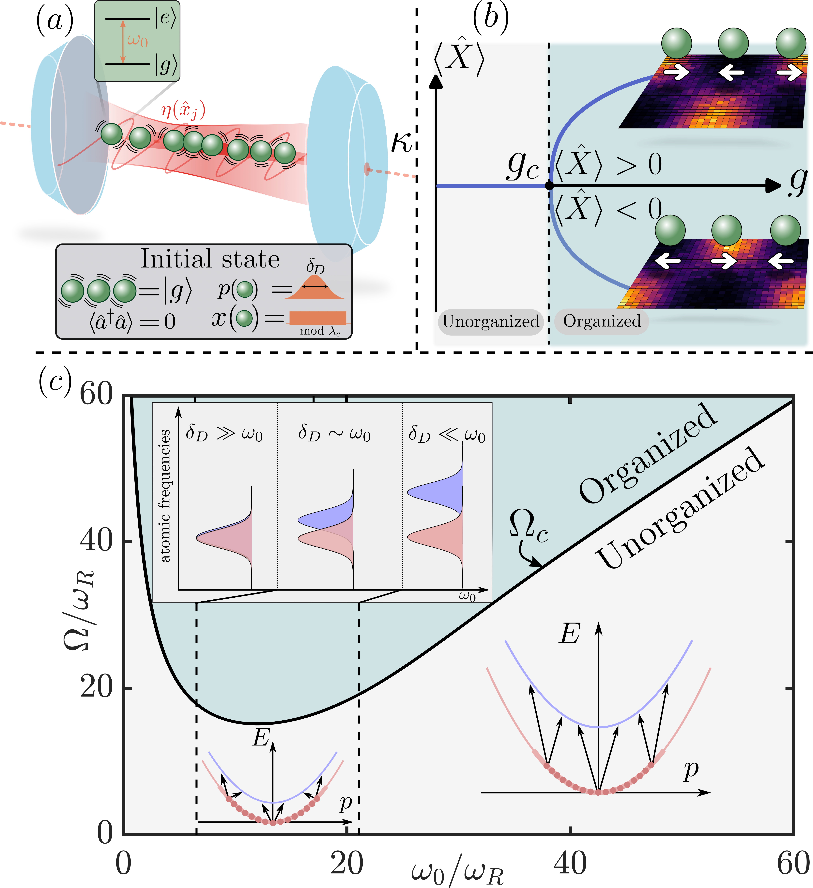
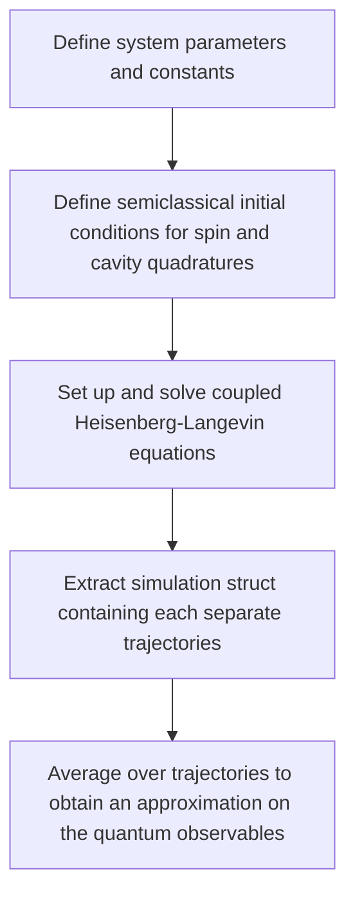
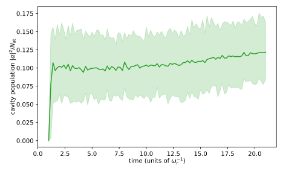

# SpinOrg.jl

This program provides a comprehensive guide to understanding, utilizing, and modifying the Julia codebase designed to solve the differential equations governing the dynamics of a collection of spins with kinetic energy in a cavity. The code implements a combination of the [Truncated Wigner](https://www.sciencedirect.com/science/article/pii/S0003491610000382?via%3Dihub) for the cavity and spin-motional variables and [Discrete Truncated Wigner](https://journals.aps.org/prx/abstract/10.1103/PhysRevX.5.011022) for the internal spin degrees of freedom, generates the Heisenberg-Langevin equations for these variables for each spin and solves them using state-of-the-art numerical techniques from `DifferentialEquations.jl`. For further details on the theory, realistic parameter ranges and general physics behind the code, see [the paper once available](https://arxiv.org/search/?searchtype=author&query=Nairn%2C+M).

<div style="text-align:center">
    
</div>

## Overview
The following workflow roughly describes how to implement the code. The code has been developed to specifically address our Lindbladian of interest:

$$\partial_t \hat{\rho} = -\frac{\mathrm{i}}{\hbar}\left[\hat{H}, \hat{\rho}\right] + 2\kappa\left(\hat{a}\hat{\rho} \hat{a}^\dagger-\frac{1}{2}\{\hat{a}^\dagger \hat{a}, \hat{\rho}\}\right)$$

where the unitary dynamics are governed by, 

$$     \hat{H}=-\hbar\Delta \hat{a}^\dagger \hat{a} + \hat{H}_{\mathrm{at}}+ \hbar Ng\hat{X}\left( \hat{a}^\dagger +\hat{a}\right). $$

In principle, however, it suffices to change the Heisenberg-Langevin equations fed into the program to study a range of weakly to strongly coupled spin-cavity models where we expect our semiclassical approach to hold. 
The code performs as follows:



The workflow described above may be split into the following functions. We define the system parameters through the struct `System_p`,

```julia
struct System_p
    U₁::Float64 #Governs the number-conserving cos^2 type coupling (has been set to zero throughout our study)
    U₂::Float64 # "" non-number conserving (has been set to zero throughout our study)
    g₁::Complex{Float64} # Number-conserving spin-cavity coupling
    g₂::Complex{Float64} # Counter-rotating spin-cavity coupling
    ω::Float64 #Spin inversion frequency
    Δc::Float64 # Cavity detuning
    κ::Float64 # Cavity photon loss rate
    delta_D::Float64 # Doppler width ~ temperature
    N::Int # Atom number
    tspan::Tuple{Float64,Float64} # Simulation time in inverse atomic recoil units
    N_MC::Int # Number of initializations, i.e. monte carlo trajectories
end
```
from which the initial conditions are built via the `define_prob_from_parameters` function according to our hybrid discrete-continous Truncated Wigner sampling.

```julia
function initial_conditions(p::System_p, seed=abs(rand(Int)))
    N::Int = p.N
    Random.seed!(seed) # random number generator
    u0 = zeros(5N + 2) # All system variables, internal+motional degrees of freedom per spin + 2 cavity quadratures

    u0[1:N] = 2pi.*rand(N) # generate random positions, uniformly accross a full cavity wavelength
    u0[N+1:2N] = p.delta_D .* randn(N) # generate random momenta sampled from a Gaussian.

    u0[2N+1:4N] = 2bitrand(2N) .- 1  # σˣⱼ and σʸⱼ are 1 or -1  
    u0[4N+1:5N] .= -1. # σᶻⱼ = -1, atoms in the ground state 

    u0[5N+1:end] .= 0 # cavity empty
    return u0
end
```
The Heisenberg-Langevin equations are then explicitly passed on, with the deterministic part given by

```julia
function f_det(du,u,p,t)
    # t is in unit of w_R^{-1}

    # u = [ xⱼ,     pⱼ,      σˣⱼ,       σʸⱼ,      σᶻⱼ,    aᵣ,    aᵢ]
    #     [1:N, N+1:2N, 2N+1..3N, 3N+1..4N, 4N+1..5N, 5N+1, 5N+2]
    # x_j in units of 1/kc (x'_j = kc x_j)
    # p_j in units of hbar*kc (p'_j = p_j/(hbar*kc))

    # ancilla variables
    N::Int = p.N
    REP::Float64 = real(p.S₁) + real(p.S₂) # ℜ(S₁) + ℜ(S₂) 2g
    REM::Float64 = real(p.S₁) - real(p.S₂) # ℜ(S₁) - ℜ(S₂) 0 
    IMP::Float64 = imag(p.S₁) + imag(p.S₂) # ℑ(S₁) + ℑ(S₂) 0
    IMM::Float64 = imag(p.S₁) - imag(p.S₂) # ℑ(S₁) - ℑ(S₂)
    aa::Float64 = (u[5N+1]^2 + u[5N+2]^2 - 0.5) # aᵣ² + aᵢ² - 1/2
    bb::Float64 = 2p.Δc
    cc::Float64 = 0.0
    dd::Float64 = 0.0

    for j = 1:N
        # ancilla variables
        sinuj::Float64, cosuj::Float64 = sincos(u[j])
        bb -= ((1-u[4N+j])p.U₁ + (1+u[4N+j])p.U₂)cosuj^2
        cc -= ( IMM*u[2N+j] + REM*u[3N+j] )cosuj
        dd += ( REP*u[2N+j] - IMP*u[3N+j] )cosuj

        # positions x_j
        du[j] = 2u[N+j]
        # momenta p_j
        du[N+j] = sinuj * ( cosuj*( (1-u[4N+j])p.U₁ + (1+u[4N+j])p.U₂ ) * aa + ( REP*u[2N+j]u[5N+1] + REM*u[3N+j]u[5N+2] + IMM*u[2N+j]u[5N+2] - IMP*u[3N+j]u[5N+1] ) )
        # sigmax_j
        du[2N+j] = -u[3N+j]*(p.Δₑ-(p.U₁-p.U₂)*cosuj^2*aa) - 2cosuj*u[4N+j] * (IMP*u[5N+1]-REM*u[5N+2])
        # sigmay_j
        du[3N+j] = u[2N+j]*(p.Δₑ-(p.U₁-p.U₂)*cosuj^2*aa) - 2cosuj*u[4N+j] * (REP*u[5N+1]+IMM*u[5N+2])
        # sigmaz_j
        du[4N+j] = 2cosuj*(IMP*u[2N+j]u[5N+1] + IMM*u[3N+j]u[5N+2] - REM*u[2N+j]u[5N+2] + REP*u[3N+j]u[5N+1])
    end

    # a_r
    du[5N+1] = bb/2 * u[5N+2] + cc/2 - p.κ*u[5N+1]
    # a_i
    du[5N+2] = -bb/2 * u[5N+1] + dd/2 - p.κ*u[5N+2]

end
```
and the stochastic part including only noise in the cavity quadratures with their usual Langevin-type noise correlations.
```julia
function f_noise(du,u,p,t)
    N::Int = p.N
    du[1:5N] .= 0.0
    du[5N+1] = sqrt((1/2)*p.κ)
    du[5N+2] = sqrt((1/2)*p.κ)
end
```
To build the multiple iterations of the system, and thus generating the initial noise in the system, we then borrow the ```EnsembleProblem``` capabilities of ```DifferentialEquations.jl```:

```julia
    function define_prob_from_parameters(p::System_p,seed=abs(rand(Int)))
        # initial conditions
        Random.seed!(seed) # random number generator
        u0 = initial_conditions(p,abs(rand(Int)))
        u0_arr = [initial_conditions(p,abs(rand(Int))) for j=1:p.N_MC]

    # NEED TO DEFINE THE FUNCTION TO REDRAW INITIAL CONDITIONS AT EVERY TRAJECTORY
        function prob_func(prob,i,repeat)
            # @. prob.u0 = initial_conditions(N,κ,rng)
            @. prob.u0 = u0_arr[i]
        prob
        end

        prob = SDEProblem(f_det,f_noise,u0,p.tspan,p)
        monte_prob = EnsembleProblem(prob, prob_func = prob_func)

        return prob, monte_prob
    end
```
In practice, all the functionalities described above will lie under the hood of the workhorse of the program, ```many_trajectory_solver```, which, once the Heisenberg-Langevin equations are defined, only needs the parameter struct passed to solve the set of SDEs:
```julia
    function many_trajectory_solver(p::System_p;saveat::Float64,seed::Int=abs(rand(Int)),maxiters::Int=Int(1e12))
        prob, monte_prob = define_prob_from_parameters(p,seed)
        elt = @elapsed sim = solve(monte_prob::EnsembleProblem, SOSRA2(), EnsembleThreads(), trajectories=p.N_MC, saveat=saveat, maxiters=maxiters, progress=true)
        println("done in $elt seconds.")
        return sim
    end
### We can also pass several parameters at once to the solver when we want to scan parameter space
    function many_trajectory_solver(ps::Array{System_p,1};saveat::Float64,seed::Int=abs(rand(Int)),maxiters::Int=Int(1e12))
        prob, monte_prob = define_prob_from_parameters(ps,seed)
        N_MC = sum([p.N_MC for p in ps])
        elt = @elapsed sim = solve(monte_prob::EnsembleProblem, SOSRA2(), EnsembleThreads(), trajectories=N_MC, saveat=saveat, maxiters=maxiters, progress=true)
        println("done in $elt seconds.")
        return sim
    end
```
For each trajectory, we obtain a struct ```Sol```, containing the array of dynamical variables at every given timestep, keeping track of the parameters and the algorithm used in that particular simulation. When we instead perform a simulation with multiple realizations, we obtain a ```sim::Array{Sol,1}``` object, where we stack up all the individual ```Sol``` for each trajectory in $1\leq i\leq\mathcal{N}_T$. 

We approximate the true dynamics of the quantum operators by averaging over the trajectories of the semiclassical variables such that, if we want to track the dynamics of some operator $\hat{O}(t)$ we average its semiclassical counterpart $O_i$ such that $\hat{A}(t)\approx \mathcal{N}_T^{-1}\sum_i O_i$. We do this as follows:

```julia
Base.@kwdef struct Observable
    s_traj
    formula::String
    short_name::String = formula
    name::String = short_name
end

function expect(o::Observable,sol::Sol)
    o.s_traj(sol)
end

function expect_full(o::Observable,sim::Array{Sol,1})
    [expect(o,sim[j]) for j=1:length(sim)]
end

function expect(o::Observable,sim::Array{Sol,1})
    Os = expect_full(o,sim)
    Omean = mean(Os)
    Ostd = stdm(Os,Omean)
    bb = hcat(Os...)
    Oq90 = [quantile(bb[i,:],[0.05,0.95]) for i in 1:size(bb)[1]]

    return Omean, Ostd, Oq90
end
```

## Example usage
Here we describe how we run the dynamics in practice, for a particular point in the phase diagram which we know to be _strongly organized_, for more info see the paper. 
```julia

# Import the source and plotting packages
include("selforg_core.jl")
include("plotting.jl")

# Define simulation parameter struct
# recall the frequency unit is inverse recoils \omega_R^{-1}
N = 100 ; # number of atoms
kappa = 100; #cavity photon loss rate
omega = 80 #inversion frequency \omegau goes with \sigma_z
Deltac = -kappa # cavity detuning
Ntraj = 100; #number of trajectories
tlist = (0.0, 20.0); #sim time
deltaD = 10; #doppler width ~ temperature ###
g = 100 # single atom-cavity coupling
g_scaled = sqrt.(-1 * (kappa^2 + Deltac^2) / (2 * Deltac) / N) * sqrt.(g) #rescaled collective coupling

p= System_p(0.0, 0.0, g_scaled, g_scaled, omega, Deltac, kappa, deltaD/2, N, tlist, Ntraj)

# Launch simulation, initial conditions and noise over several initializations is automatically set
sim = many_trajectory_solver(p, saveat=0.2, seed=abs(rand(Int)))
```

If we then wanted to plot, say, the cavity population over time we evaluate ```y,y_std,y_q90 = expect(adaga,sim)``` to obtain the average, standard deviation and top 90 quantile of our many trajectory simulation. 
```julia
function plot_adaga(sim::Array{Sol,1})
    y,y_std,y_q90 = expect(adaga,sim)
    y_q90 = hcat(y_q90...)
    tlist = sim[1].t

    matplotlib[:rc]("axes", labelpad=0.5)

    fig, ax = subplots(1,1,figsize=[6.50, 4.])
    color="C2"
    ax[:set_ylabel](L"cavity population $|\alpha|^2/N_\mathrm{at}$")
    ax[:set_xlabel](L"time (units of $\omega_\mathrm{r}^{-1}$)")
    ax[:plot](tlist.+1,y.*1/sim[1].p.N,color=color)
    ax[:fill_between](tlist.+1,y_q90[1,:]*1/sim[1].p.N,y_q90[2,:]*1/sim[1].p.N,color=color,alpha=0.2)
    fig[:tight_layout]()
    return fig, ax
end
```

Where we can find the immediate emergence of the superradiant phase for the cavity field:



Note that the plotting scripts are written wholly using PyPlot and not Julias native ```Plots.jl```.


### Acknowledgements
Many thanks to Luigi Gianelli who developed a good part of the original code.
